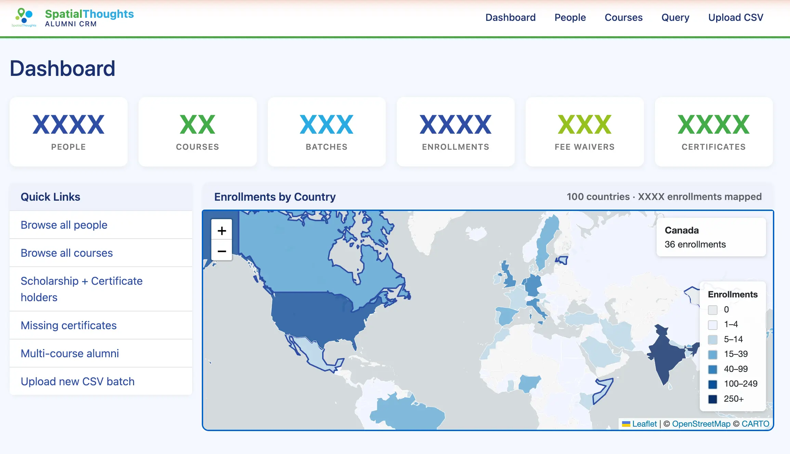
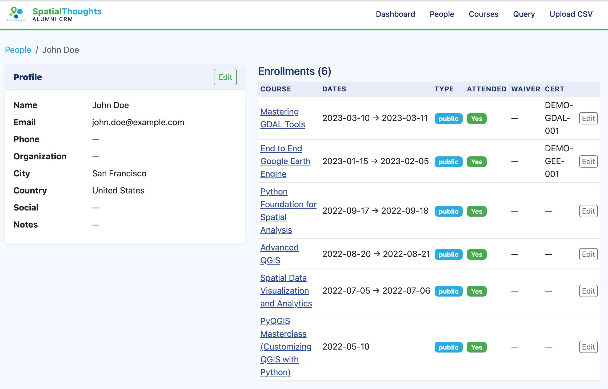
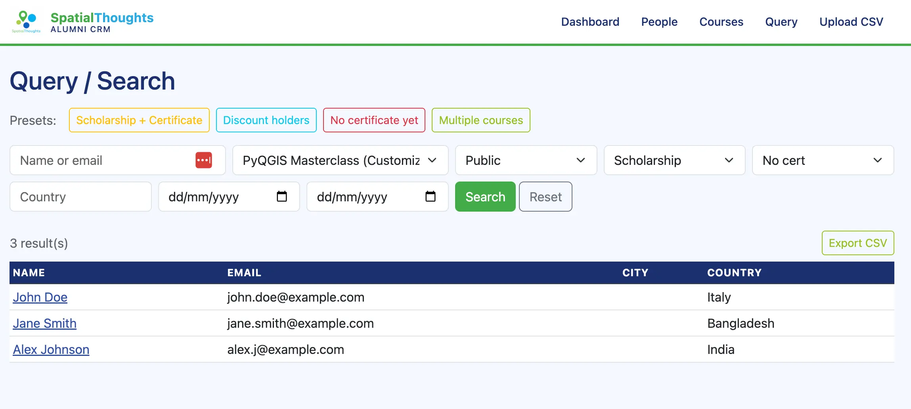

# CRM App

A lightweight web-based CRM (Customer Relationship Management) application for tracking training course enrollments, participants, and certifications. Built with Flask and SQLite.

## Features

- **Dashboard** — at-a-glance stats: total people, courses, batches, enrollments, scholarships, and certificates
- **People** — browse, search, and filter participants by name, email, country, course, fee waiver status, or certification
- **Person profiles** — view and edit contact details, secondary emails, and enrollment history; merge duplicate records
- **Courses & Batches** — view courses with enrollment counts; drill into individual batches and their rosters
- **Enrollments** — record attendance, fee waivers, and certificate IDs per enrollment
- **CSV Import** — upload a CSV file to bulk-import people and enrollments (download a template from the upload page)
- **Query & Export** — filter people with advanced criteria and export results to CSV; includes preset queries (scholarship holders with certs, discount waivers, no certificate, multi-course enrollees)
- **World map** — enrollment counts visualised by country on the dashboard

## Screenshots


*Dashboard with summary stats and enrollments by country map*


*Person profile showing contact details and course enrollment history*


*Query page with preset filters, advanced search, and CSV export*

## Installation

### Prerequisites

- [Conda](https://docs.conda.io/en/latest/miniconda.html) (Miniconda or Anaconda)

### Setup

1. Clone or download the repository and navigate into the project folder:

   ```bash
   cd alumni-crm-app
   ```

2. Create and activate a conda environment:

   ```bash
   conda create -n crm python=3.11 -y
   conda activate crm
   ```

3. Install dependencies:

   ```bash
   pip install -r requirements.txt
   ```

## Running the App

```bash
flask --app app run
```

The app will be available at **http://localhost:5000**.

> **Note:** On macOS, port 5000 may be occupied by AirPlay Receiver (Control Center). Use a different port if needed:
> ```bash
> flask --app app run --port 5001
> ```

### Database Path

By default the app looks for `crm.db` in the current folder. To use a database stored elsewhere, set the `CRM_DB` environment variable to the full path:

```bash
CRM_DB=/path/to/your/crm.db flask --app app run --port 5001
```

This is useful for keeping the database outside the repository (recommended if the database contains personal data).

### Try It with Test Data

A `test.db` with fake data (5 obviously fake people, 2 courses, 3 batches, and sample enrollments/certificates) is included so you can explore the interface without setting up real data:

```bash
CRM_DB=test.db flask --app app run --port 5001
```

Then open **http://localhost:5001**.

To regenerate `test.db` at any time:

```bash
python create_test_db.py
```

### First Run

The SQLite database is created automatically on first run. Use the **Upload** page to import data from a CSV file. A template CSV can be downloaded from that page.
